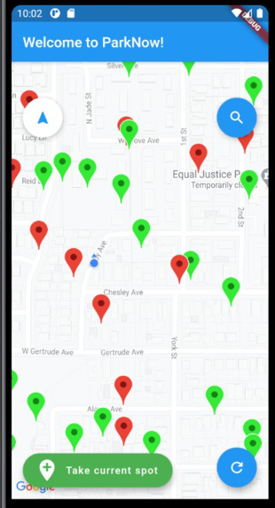

# Park Now

A native application that helps you find the nearest road-side parking spots.

<p align="center">
  
</p>

## Inspiration
Coming from the bay area, parking is always a big headache. It had actually gotten so bad in Berkeley that you have to win a [Nobel Prize for a parking spot](https://www.npr.org/templates/story/story.php?storyId=113883274). Unfortunately, most ordinary joes like us don’t have a chance in these big brain awards, but we believe parking a car should be fast, easy, and cheap hoping that we can easily park anywhere we want, anytime we want, perhaps now. The idea stemmed from a story that began back in high school when one of our members had to help his father pay for parking tickets. Being a delivery driver, parking tickets were always something troubling for their family. These road-side parking spots in San Francisco are like needles in a haystack. Spending 30 minutes cruising around the block is a norm. Considering that 70% of traffic jams are caused by cruising for parking, We knew there had to be a better solution for drivers, and the Earth. 

## What it does
Park Now is a mobile application that has multiple easy to use features that are tailored to ease your parking spot finding dilemma. The app allows you to see empty road-side parking spots left by other users on the map and automatically searches the closest one in your vicinity. All you have to do is to tap on 2 buttons, one to search for the closest spot, the other to show others that you occupy the spot. In addition, once you marked your location when parked, if you choose to leave your contact, and say there are some unexpected situations that happened to your car such as a break in, other users of the app have the ability to quickly notify you about the situation. Since your parked location is marked you also never have to worry about not being able to find your car! Once you decide to leave, just tap on the same button as you tapped for occupying the spot, and your old spot will be up for grabs. To top it all off, we calculate the amount of carbon you have prevented from emitting and the amount of time you have saved to show that you are doing a good thing for both yourself and the world.

## How we built it*
We built our mobile app using Flutter and Dart. We set up a Google Firestore NoSQL database and Google Maps API to contain and display locations of the markers, whether parked or vacant, and contact information. We utilized a hashing function that turns Latitude and Longitude into a Base32 hash, to calculate whether your current location is in the same parking spot as the previous user. Lastly, We calculated how much CO2 and time saved by comparing to the average parking time in that area.

## What's next for Park Now
We had to simplify some of our features in order to complete Park Now in time. In the future, we’d like to improve upon those features and eventually publish on all mobile platforms for people to use. Moreover, we want this to become a standard feature on self-driving cars for them to have the ability to find road-side parking themselves.

See our Devpost article for more details: https://devpost.com/software/park-now 

## Getting Started

These instructions will get you a copy of the project up and running on
your local machine for development and testing purposes. 

### Prerequisites

To run Park Now on your local machine, you'll need to install Flutter, Dart and Git. 

Flutter & Dart: Follow the installation guide shown on the Flutter website https://flutter.dev/docs/get-started/install
Git: https://git-scm.com/download/win 

### Installing

Use git clone to install the Flutter application, which runs on Android, iOS, and Web.

Navigate to your desired file location and clone the repository.
```git
git clone https://github.com/fredhua233/Treehacks-2021.git
```

Checking the Flutter Environment.
```Flutter
flutter doctor
```

Installing & updating the needed libraries.
```Flutter
flutter pub get
```

Run the application on an emulator or on an external device.
```Flutter
flutter run
```

## Contributing

Pull requests are welcomed. For major changes, please open an issue first to discuss what you would like to change.

Please make sure to update tests as appropriate.

## Authors

See the list of [contributors](https://github.com/fredhua233/Treehacks-2021/contributors) who contributed to this project.

## License

This project is licensed under [MIT](LICENSE.md) License - see the [LICENSE.md](LICENSE.md) file for details
